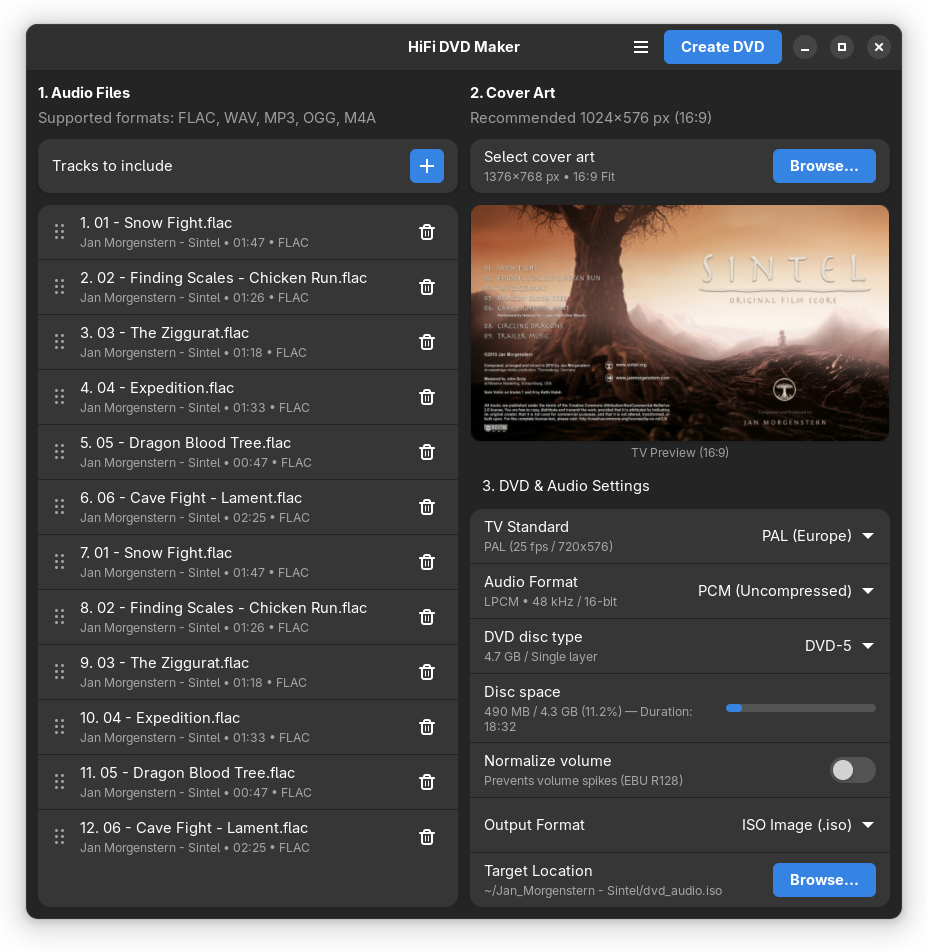

# HiFi DVD Maker

**HiFi DVD Maker** is a modern GTK4 / Libadwaita desktop application designed for Linux to easily author and create high-fidelity audio DVDs with custom cover art for your music compilation, ready to burn to physical media or play directly.

<p align="center">
  
</p>

---

## Installation

### Option 1: Download Pre-built Flatpak Bundle (Recommended)

The easiest way to install **HiFi DVD Maker** on any Linux distribution:

1. Go to the [Releases](https://github.com/marcopcabrera/HiFiDvdMaker/releases) page.
2. Download the latest `HiFiDvdMaker.flatpak` bundle.
3. Double-click the downloaded file to open it in your Software Center (GNOME Software / KDE Discover) and click **Install**.

Alternatively, you can install the bundle via the terminal:

```bash
flatpak install --user HiFiDvdMaker.flatpak
```

## Features

- **High-Fidelity Audio Support**: Author uncompressed, CD-quality (LPCM) audio DVDs with pristine fidelity.
- **AC3 Compression Option**: Optional Dolby Digital (AC3) audio encoding support for maximum compatibility and space savings.
- **Multiple Output Formats**: Export your creation as an ISO disc image file or directly as a `VIDEO_TS` folder structure.
- **Standalone DVD Navigation**: Generates standard DVD tracks/chapters that allow skipping forward and backward on any home DVD player or car system using the remote control.
- **Compilation Cover Art**: Easily upload custom cover art to display as the background for your music compilation disc.
- **Multilingual Support**: Available in 12 languages.
- **GNOME Native**: Crafted with GTK4 and Libadwaita following the latest GNOME Human Interface Guidelines (HIG).
- **Standalone Flatpak Package**: Fully sandboxed and distributed as a standalone .flatpak bundle for seamless installation across Linux distributions.

## Building from Source

### Prerequisites
Make sure you have `flatpak` and `flatpak-builder` installed on your system.

### Local Build & Test
To build and install the application locally:

```bash

# Clone the repository
git clone https://github.com/marcopcabrera/HiFiDvdMaker.git
cd HiFiDvdMaker

# Build and install the Flatpak package locally
flatpak-builder --user --install --force-clean build-dir io.github.marcopcabrera.HiFiDvdMaker.json
```
```bash
# Run the installed application
flatpak run io.github.marcopcabrera.HiFiDvdMaker
```
### License

This project is licensed under the GPL-3.0-or-later License.
